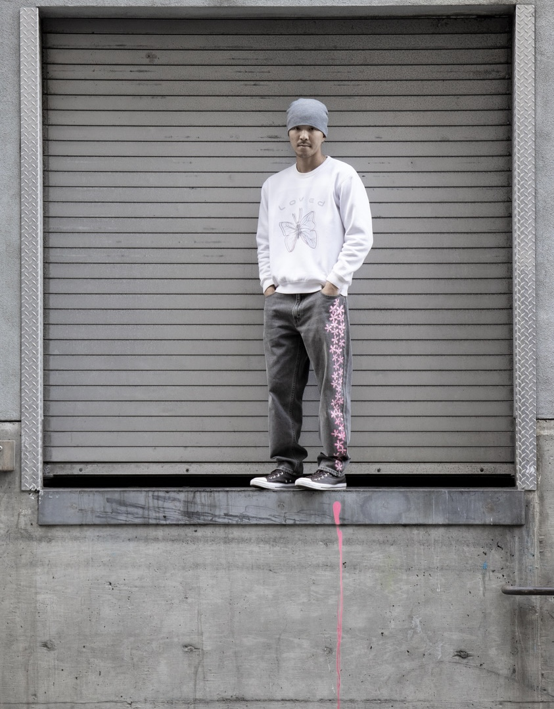
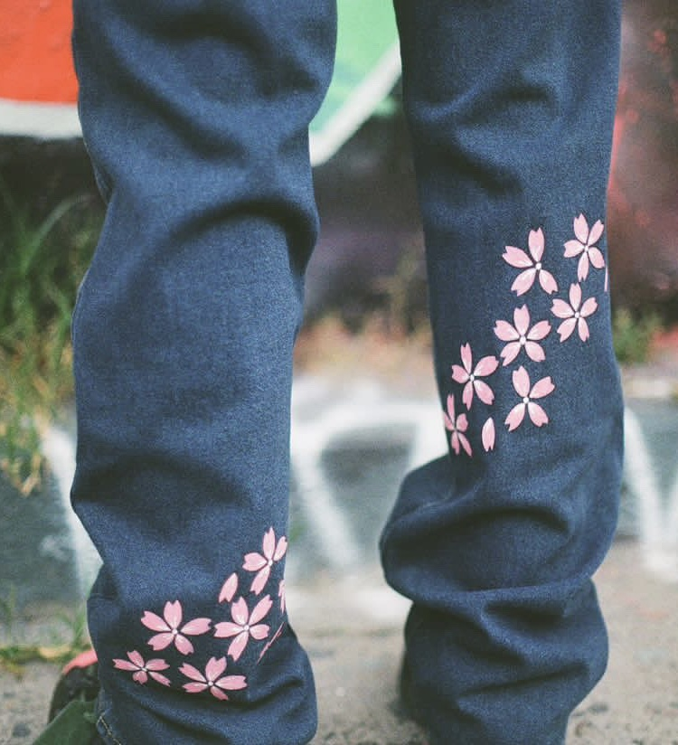
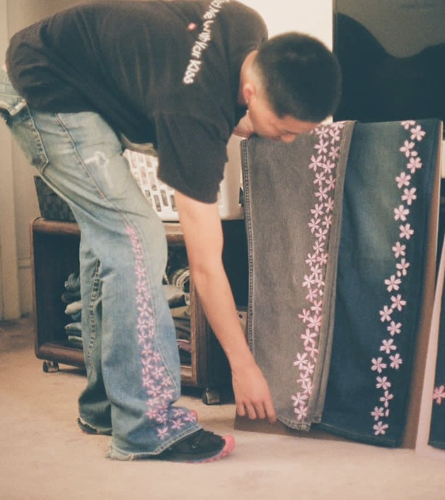
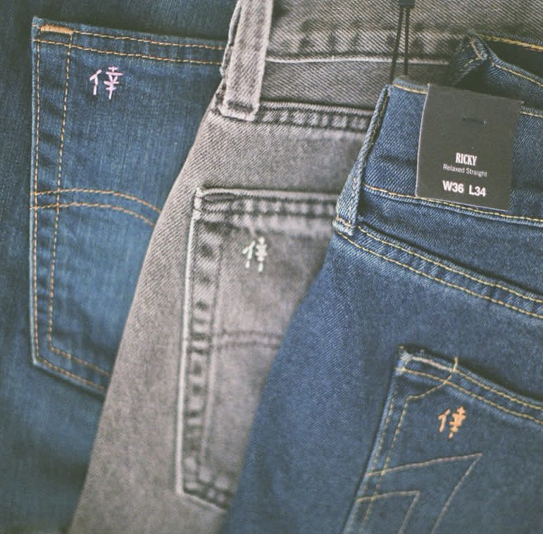

# no_name.nowhere

> **Japanese heritage × streetwear × luxury — by [Koh Maeda](https://kohmaeda.com)**

```
"Each blossom, like each human, falls at its own pace,
 for its own reason. But we rise again."
```



---

## 概要 / Concept

**no_name.nowhere** は、日本の職人技とストリートウェアの境界を再定義するブランド。
出処を持たぬ匿名のクラフトと、所属を超えた「どこでもない場所」から発信される表現。

A label exploring the tension between Japanese craftsmanship and streetwear culture —
nameless makers, placeless origins, distinct intent.

---

## 哲学 / Philosophy

- **匿名性 / Anonymity** — 作品はクラフト本位。製作者の名前より、素材と意図が語る。
- **再生 / Rebirth** — シルク・着物・デニム — 一度命を終えた素材に二度目を与える。
- **境界の曖昧化 / Liminality** — 伝統工芸 / ストリート / ラグジュアリー、その境界線で立つ。

---

## コレクション / Collections

### CHERRY.B
桜、儚さ、再生。デニムに咲く花。
Cherry blossoms, ephemerality, rebirth — flowers blooming on denim.






### KIMONO UPCYCLING
ヴィンテージ着物・シルクからの再構築。
Reconstruction from vintage kimono and silk.

### PATCHWORKS DENIM
継ぎ接ぎの記憶、デニムの第二人生。
Patched memory, denim's second life.

---

## 倖 / The Mark

すべての作品の back pocket に刺繍される、創設者の漢字一文字。
A single kanji embroidered on every back pocket — the founder's mark.



---

## 出処 / Origins

- Asakichi Antique, Japantown SF — $25 silk kimono. November 2, 2024.
- 縫い直し、染め直し、解体、再構築。
- Stitched, dyed, deconstructed, rebuilt.

---

## 創設者 / Founder

**Koh Maeda** （倖）
- AAU '25 — BA in Communications & Media Technologies
- San Francisco Bay Area — Tokyo
- [kohmaeda.com](https://kohmaeda.com) · [@no_name.nowhere](https://instagram.com/no_name.nowhere)

---

## アーカイブ / Archive

This repository is the working archive of the brand. Drops, lookbooks, and process documentation will be added over time.

このリポジトリは進行中のブランドアーカイブ。ドロップ、ルックブック、制作プロセスを順次追加。

---

```
no name. no where.
名もなく、場もなく — されど確かにここにある。
```

© 2024–2026 Koh Maeda · All works original.
